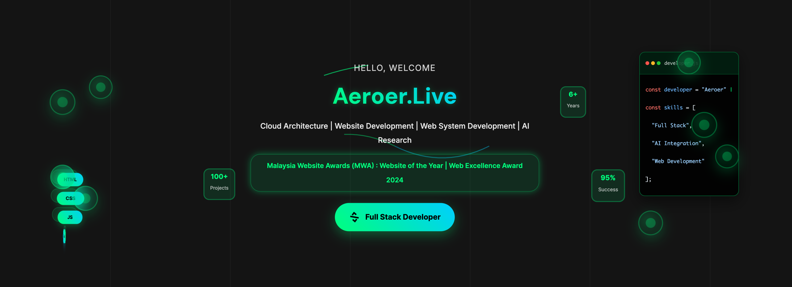
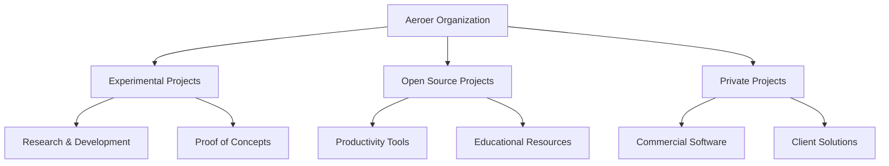

<div align="center">

<p align="center">
  <a href="https://aeroer.live" target="_blank">
    
  </a>
</p>

</div>

<div align="center">


**Experimental & Open-Source Programming Projects** | **Private Development Repositories**

[](https://www.aeroer.live)
[](https://www.aeroer.blog)
[](https://www.productivitytask.live)

</div>


---

## 📊 Organization Status

```bash
# System Status Check
$ systemctl status aeroer-org
● Aeroer-Live.service - Cloud Architecture | Website Development | Web System Development | AI Research
   Active: active (running) 
   Status: Operational 
   Projects: 15+ repositories
   Languages: JavaScript, TypeScript, Python, Go, Rust, C++
   Deployment: Cloudflare Pages + Workers
```

## 🛠️ Technology Stack

```typescript
const techStack = {
  frontend: {
    framework: "React/Next.js",
    styling: "Tailwind CSS",
    stateManagement: "Zustand/Redux",
    deployment: "Cloudflare Pages"
  },
  backend: {
    runtime: "Cloudflare Workers",
    database: "Cloudflare D1",
    authentication: "Cloudflare Access",
    api: "REST/GraphQL"
  },
  tools: {
    versionControl: "Git",
    ci_cd: "GitHub Actions",
    monitoring: "Cloudflare Analytics",
    testing: "Jest/Vitest"
  }
};
```


## 📈 Project Metrics



## 🔧 Development Workflow

```yaml
# .github/workflows/development.yml
name: Development Pipeline
on:
  push:
    branches: [main, develop]
  pull_request:
    branches: [main]

jobs:
  test:
    runs-on: ubuntu-latest
    steps:
      - uses: actions/checkout@v3
      - name: Setup Node.js
        uses: actions/setup-node@v3
        with:
          node-version: '18'
      - name: Install dependencies
        run: npm ci
      - name: Run tests
        run: npm test
      - name: Build project
        run: npm run build
```


## 📊 Code Statistics

```bash
# Repository Analysis
$ cloc --by-file .
-------------------------------------------------------------------------------
Language                     files          blank        comment           code
-------------------------------------------------------------------------------
TypeScript                   45             234          156             2341
JavaScript                   23             123           89             1234
Python                       12              67           45              567
Go                            8              34           23              234
Rust                          5              23           12              123
-------------------------------------------------------------------------------
SUM:                         93             481          325             4499
-------------------------------------------------------------------------------
```


