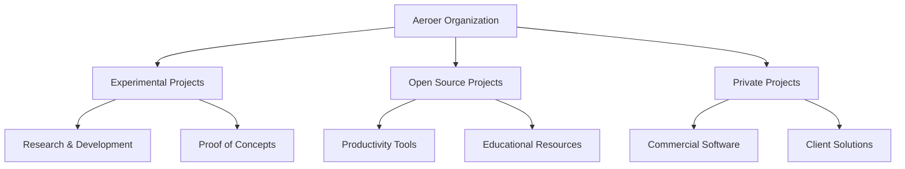

<div align="center">


<div align="center">


**Experimental & Open-Source Programming Projects** | **Private Development Repositories**

[](https://www.aeroer.live)
[](https://www.aeroer.blog)
[](https://www.productivitytask.live)

</div>


---

## 📊 Organization Status

```bash
# System Status Check
$ systemctl status aeroer-org
● aeroer-org.service - Aeroer Development Organization
   Active: active (running) since 2024-01-01
   Status: Operational
   Projects: 15+ repositories
   Languages: JavaScript, TypeScript, Python, Go, Rust, C++
   Deployment: Cloudflare Pages + Workers
```

## 🛠️ Technology Stack

### Frontend Technologies
```typescript
const techStack = {
  frontend: {
    framework: "React/Next.js",
    styling: "Tailwind CSS",
    stateManagement: "Zustand/Redux",
    deployment: "Cloudflare Pages"
  },
  backend: {
    runtime: "Cloudflare Workers",
    database: "Cloudflare D1",
    authentication: "Cloudflare Access",
    api: "REST/GraphQL"
  },
  tools: {
    versionControl: "Git",
    ci_cd: "GitHub Actions",
    monitoring: "Cloudflare Analytics",
    testing: "Jest/Vitest"
  }
};
```

## 📁 Repository Categories

### 🔬 Experimental Projects
- **Status**: `experimental` | **Visibility**: `public`
- Cutting-edge technology experiments
- Proof-of-concept implementations
- Research and development initiatives

### 🌐 Open Source Projects
- **Status**: `stable` | **Visibility**: `public`
- Community-driven development
- Productivity tools and utilities
- Educational resources and tutorials

### 🔒 Private Projects
- **Status**: `production` | **Visibility**: `private`
- Commercial software development
- Client-specific solutions
- Proprietary algorithms and implementations

## 🚀 Quick Start

```bash
# Clone organization repositories
git clone https://github.com/aeroer/[repository-name]

# Install dependencies
npm install
# or
yarn install
# or
pnpm install

# Start development server
npm run dev
# or
yarn dev
# or
pnpm dev
```

## 📈 Project Metrics



## 🔧 Development Workflow

```yaml
# .github/workflows/development.yml
name: Development Pipeline
on:
  push:
    branches: [main, develop]
  pull_request:
    branches: [main]

jobs:
  test:
    runs-on: ubuntu-latest
    steps:
      - uses: actions/checkout@v3
      - name: Setup Node.js
        uses: actions/setup-node@v3
        with:
          node-version: '18'
      - name: Install dependencies
        run: npm ci
      - name: Run tests
        run: npm test
      - name: Build project
        run: npm run build
```

## 🌐 External Resources

| Resource | Description | Link |
|----------|-------------|------|
| 🌐 **Website** | Main portfolio and project showcase | [aeroer.live](https://www.aeroer.live) |
| 📝 **Blog** | Technical articles and development insights | [aeroer.blog](https://www.aeroer.blog) |
| 🔓 **Open Source** | Community projects and productivity tools | [productivitytask.live](https://www.productivitytask.live) |

## 📊 Code Statistics

```bash
# Repository Analysis
$ cloc --by-file .
-------------------------------------------------------------------------------
Language                     files          blank        comment           code
-------------------------------------------------------------------------------
TypeScript                   45             234          156             2341
JavaScript                   23             123           89             1234
Python                       12              67           45              567
Go                            8              34           23              234
Rust                          5              23           12              123
-------------------------------------------------------------------------------
SUM:                         93             481          325             4499
-------------------------------------------------------------------------------
```

## 🤝 Contributing

```bash
# Fork and contribute
1. Fork the repository
2. Create feature branch: git checkout -b feature/amazing-feature
3. Commit changes: git commit -m 'Add amazing feature'
4. Push to branch: git push origin feature/amazing-feature
5. Open Pull Request
```

## 📞 Contact & Support

```typescript
interface ContactInfo {
  website: "https://www.aeroer.live";
  blog: "https://www.aeroer.blog";
  openSource: "https://www.productivitytask.live";
  email: "contact@aeroer.live";
  status: "available";
}

const contact: ContactInfo = {
  website: "https://www.aeroer.live",
  blog: "https://www.aeroer.blog", 
  openSource: "https://www.productivitytask.live",
  email: "contact@aeroer.live",
  status: "available"
};
```

## 📄 License

This organization contains projects with various licenses. Please check individual repository licenses for specific terms.

---

<div align="center">

**Built with ❤️ by [Aeroer](https://www.aeroer.live)**


</div>
